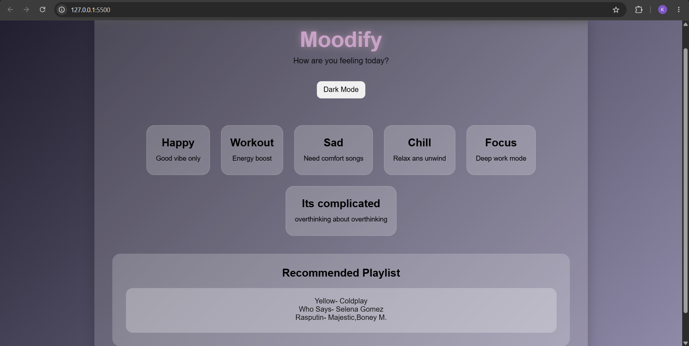

# Moodify

Moodify is a simple and interactive music recommendation web application that recommends songs based on the user's mood.
It is built using HTML,CSS,and JavaScript with a clean ,responive interface.

# Live Demo
 https://khushi45615-bot.github.io/Moodify/

 ## Features
 - Select songs based on your mood
 - Displays 3 random song recommendations
 - Dark/light mode
 - Responsive design for  different screen sizes
 - Modern and clean user interface

 ## Technologies Used
 -HTML
 -CSS
 -javaScript

 ## Future improvments
 - Spotify API integration
 - play songs directly from the app
 - Save Favorite songs
 - More animations ans UI improvements

   
 
